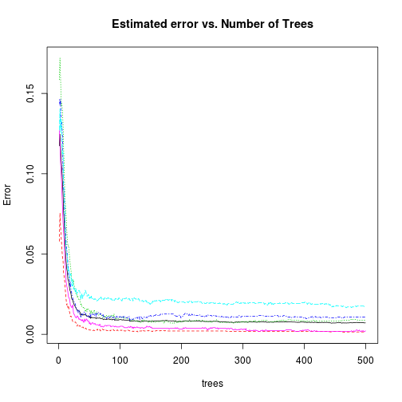

Using Sensors to predict Physical Movements
========================================================
### Abstract
Sensor data is aready used by the fitness industry to track heart rate and steps taken.  A next step is to use sensors to gauge movements for other variables such such as correctness.  This study will use sensor data to develop a model to detect the difference between 5 different variations of a movement using machine learning.

#### Data Source
The data used here comes from research conducted in conjunction with the publishing of the paper Qualitative Activity Recognition of Weight Lifting Exercises [1].  The paper describes:

*Six young health participants were asked to perform one set of 10 repetitions of the Unilateral Dumbbell Biceps Curl in five different fashions: exactly according to the specification (Class A), throwing the elbows to the front (Class B), lifting the dumbbell only halfway (Class C), lowering the dumbbell only halfway (Class D) and throwing the hips to the front (Class E).*

Sensors placed on the arm (bicep), forearm, belt, and dumbell record data as the movements are performed.  The data set is comprised of over 19,000 observations, each with 52 sensor readings.  

The goal here is to use this data to build a machine learning model to predict the class of activity performed.

## Getting & Pre-processing
The data can be downloaded from http://groupware.les.inf.puc-rio.br/static/WLE/WearableComputing_weight_lifting_exercises_biceps_curl_variations.csv.

The data set is full of many summary variables with NA or no data.  The first step of pre-processing removes all of these.  Also removed because I do not intend to use them in the model are names and time stamps.  For simplicity this was done in a spreadsheet before opening the first time in R.


```r
raw.data <- read.csv("../../data/train.csv")
```


Before splitting the data into train/test I want to check for any potential predictors that have near-zero variance since they would not contribute to the model.  The caret package includes nearZeroVar to do this.


```r
library(caret)
nzv <- nearZeroVar(raw.data, saveMetrics = TRUE)
nzv[nzv$nzv, ]
```

```
## [1] freqRatio     percentUnique zeroVar       nzv          
## <0 rows> (or 0-length row.names)
```

The results show no features with low variance.

Next a check for highly correlated variables since many models benfit from reducing the correlation levels between predictors.

```r
descrCor <- cor(raw.data[,-53])
highCorr <- sum(abs(descrCor[upper.tri(descrCor)]) > 0.999)
highCorr
```

```
## [1] 0
```
Once again ther are no features to remove.

At this point I am satisfied to split the data and start developing a model.

```r
inTrain <- createDataPartition(y=raw.data$classe,p=0.6, list=FALSE)
training <- raw.data[inTrain,]
testing <- raw.data[-inTrain,]

inTest <- createDataPartition(y=testing$classe,p=0.5, list=FALSE)
cv.data <- testing[-inTest,]
testing <- testing[inTest,]

#rm(raw.data, inTrain, inTest)
```
The split is 60/20/20 into training/testing/cross-validation (cv.data)

### Model fitting
#### Random forests
I will use the randomForest package in R because it is able to handle a large number of predictors in a classification model.

```r
library(randomForest)
```
Tuning it first for the variable mtry can save time later since the optimal value can be specified in the model and therefore the model will not re-tune on every run.

```r
tuned <- tuneRF(training[,-53],training[,53])  
```

```
## mtry = 7  OOB error = 1.15% 
## Searching left ...
## mtry = 4 	OOB error = 1.1% 
## 0.03704 0.05 
## Searching right ...
## mtry = 14 	OOB error = 1.11% 
## 0.02963 0.05
```

 

The result says that mtry = 4 is the optimal value, although they are all very close.  But should still speed the model up to specify this value

Now the model will be built.  The other parameter of interest is ntree, the number of trees the model will build.  Different values were tried but I won't show them all here.  A first model of ntree=10 was tried just to gauge speed.  This model went very fast and the OOB estimate of the error was 5.25%.  It is correct to assume as ntree is increased the estimate will decrease, although not forever.  Beyond ntree=100, trials of 500, 1000 and 2000 showed little marginal return and obviously were slower.  Show below the model results, the plot shows how there is little return on more trees in this model.  So here is shown only the final model run.


```r
rf.model <- randomForest(classe~., data=training, ntree= 500, mtry=4)
print(rf.model)
```

```
## 
## Call:
##  randomForest(formula = classe ~ ., data = training, ntree = 500,      mtry = 4) 
##                Type of random forest: classification
##                      Number of trees: 500
## No. of variables tried at each split: 4
## 
##         OOB estimate of  error rate: 0.72%
## Confusion matrix:
##      A    B    C    D    E class.error
## A 3343    3    1    0    1    0.001493
## B   13 2259    7    0    0    0.008776
## C    0   19 2032    3    0    0.010711
## D    0    0   31 1897    2    0.017098
## E    0    0    1    4 2160    0.002309
```

The randomForest() model calculates an estimate for OOB error and for this model it predicts 0.72%.

This plot shows the negligible return on increasing trees beyond 100.

```r
plot(rf.model, main='Estimated error vs. Number of Trees')
```

 

## Model Results
All models were run against testing to verify performance but once again only the prdictions of the final model are shown.

```r
pred.test <- predict(rf.model,testing)
test.table <- table(pred.test,testing$classe)
test.cm <- confusionMatrix(test.table)
test.cm$table
```

```
##          
## pred.test    A    B    C    D    E
##         A 1114    2    0    0    0
##         B    1  754   11    0    0
##         C    0    3  673    7    0
##         D    0    0    0  635    0
##         E    1    0    0    1  721
```

```r
test.cm$overall[1]
```

```
## Accuracy 
##   0.9934
```

The error on this iteration was 0.66%, extremely close to the model estimate.  Because the estimate and actual were so close, we should expect the model to do similarly well with the cross-validation set.

## Cross Validation
Since the model was fitted against training and repeatedly verified against testing it is wise to do one more validation of the model against data that has not been used.  That is the purpose of the cross-validation data set.


```r
cv.pred <- predict(rf.model,cv.data)
cv.table <- table(cv.pred,cv.data$classe)
cv.cm <- confusionMatrix(cv.table)
cv.cm$table
```

```
##        
## cv.pred    A    B    C    D    E
##       A 1116    7    0    0    0
##       B    0  750    6    0    0
##       C    0    2  677    9    0
##       D    0    0    1  633    0
##       E    0    0    0    1  721
```

```r
cv.cm$overall[1]
```

```
## Accuracy 
##   0.9934
```

Once again the error was 0.66%, matching the error of the testing predictions.  This similarity of error proviedes confidence in the predictive ability of the model since the model has not receieved any feedback from the cross validation data during model building.

## Conclusion
The model built here was quite effective at predicting the activity with few tweaks to the data.  In the final assignment it correctly predicted 20/20 of observations.

## References

1. Velloso, E.; Bulling, A.; Gellersen, H.; Ugulino, W.; Fuks, H. Qualitative Activity Recognition of Weight Lifting Exercises. Proceedings of 4th International Conference in Cooperation with SIGCHI (Augmented Human '13) . Stuttgart, Germany: ACM SIGCHI, 2013.

## Appendix
### data set feature names

```r
summary(raw.data)
```

```
##    roll_belt       pitch_belt        yaw_belt      total_accel_belt
##  Min.   :-28.9   Min.   :-55.80   Min.   :-180.0   Min.   : 0.0    
##  1st Qu.:  1.1   1st Qu.:  1.76   1st Qu.: -88.3   1st Qu.: 3.0    
##  Median :113.0   Median :  5.28   Median : -13.0   Median :17.0    
##  Mean   : 64.4   Mean   :  0.31   Mean   : -11.2   Mean   :11.3    
##  3rd Qu.:123.0   3rd Qu.: 14.90   3rd Qu.:  12.9   3rd Qu.:18.0    
##  Max.   :162.0   Max.   : 60.30   Max.   : 179.0   Max.   :29.0    
##   gyros_belt_x      gyros_belt_y      gyros_belt_z     accel_belt_x    
##  Min.   :-1.0400   Min.   :-0.6400   Min.   :-1.460   Min.   :-120.00  
##  1st Qu.:-0.0300   1st Qu.: 0.0000   1st Qu.:-0.200   1st Qu.: -21.00  
##  Median : 0.0300   Median : 0.0200   Median :-0.100   Median : -15.00  
##  Mean   :-0.0056   Mean   : 0.0396   Mean   :-0.131   Mean   :  -5.59  
##  3rd Qu.: 0.1100   3rd Qu.: 0.1100   3rd Qu.:-0.020   3rd Qu.:  -5.00  
##  Max.   : 2.2200   Max.   : 0.6400   Max.   : 1.620   Max.   :  85.00  
##   accel_belt_y    accel_belt_z    magnet_belt_x   magnet_belt_y
##  Min.   :-69.0   Min.   :-275.0   Min.   :-52.0   Min.   :354  
##  1st Qu.:  3.0   1st Qu.:-162.0   1st Qu.:  9.0   1st Qu.:581  
##  Median : 35.0   Median :-152.0   Median : 35.0   Median :601  
##  Mean   : 30.1   Mean   : -72.6   Mean   : 55.6   Mean   :594  
##  3rd Qu.: 61.0   3rd Qu.:  27.0   3rd Qu.: 59.0   3rd Qu.:610  
##  Max.   :164.0   Max.   : 105.0   Max.   :485.0   Max.   :673  
##  magnet_belt_z     roll_arm        pitch_arm         yaw_arm       
##  Min.   :-623   Min.   :-180.0   Min.   :-88.80   Min.   :-180.00  
##  1st Qu.:-375   1st Qu.: -31.8   1st Qu.:-25.90   1st Qu.: -43.10  
##  Median :-320   Median :   0.0   Median :  0.00   Median :   0.00  
##  Mean   :-346   Mean   :  17.8   Mean   : -4.61   Mean   :  -0.62  
##  3rd Qu.:-306   3rd Qu.:  77.3   3rd Qu.: 11.20   3rd Qu.:  45.88  
##  Max.   : 293   Max.   : 180.0   Max.   : 88.50   Max.   : 180.00  
##  total_accel_arm  gyros_arm_x      gyros_arm_y      gyros_arm_z   
##  Min.   : 1.0    Min.   :-6.370   Min.   :-3.440   Min.   :-2.33  
##  1st Qu.:17.0    1st Qu.:-1.330   1st Qu.:-0.800   1st Qu.:-0.07  
##  Median :27.0    Median : 0.080   Median :-0.240   Median : 0.23  
##  Mean   :25.5    Mean   : 0.043   Mean   :-0.257   Mean   : 0.27  
##  3rd Qu.:33.0    3rd Qu.: 1.570   3rd Qu.: 0.140   3rd Qu.: 0.72  
##  Max.   :66.0    Max.   : 4.870   Max.   : 2.840   Max.   : 3.02  
##   accel_arm_x      accel_arm_y      accel_arm_z      magnet_arm_x 
##  Min.   :-404.0   Min.   :-318.0   Min.   :-636.0   Min.   :-584  
##  1st Qu.:-242.0   1st Qu.: -54.0   1st Qu.:-143.0   1st Qu.:-300  
##  Median : -44.0   Median :  14.0   Median : -47.0   Median : 289  
##  Mean   : -60.2   Mean   :  32.6   Mean   : -71.2   Mean   : 192  
##  3rd Qu.:  84.0   3rd Qu.: 139.0   3rd Qu.:  23.0   3rd Qu.: 637  
##  Max.   : 437.0   Max.   : 308.0   Max.   : 292.0   Max.   : 782  
##   magnet_arm_y   magnet_arm_z  roll_dumbbell    pitch_dumbbell  
##  Min.   :-392   Min.   :-597   Min.   :-153.7   Min.   :-149.6  
##  1st Qu.:  -9   1st Qu.: 131   1st Qu.: -18.5   1st Qu.: -40.9  
##  Median : 202   Median : 444   Median :  48.2   Median : -21.0  
##  Mean   : 157   Mean   : 306   Mean   :  23.8   Mean   : -10.8  
##  3rd Qu.: 323   3rd Qu.: 545   3rd Qu.:  67.6   3rd Qu.:  17.5  
##  Max.   : 583   Max.   : 694   Max.   : 153.6   Max.   : 149.4  
##   yaw_dumbbell     total_accel_dumbbell gyros_dumbbell_x  gyros_dumbbell_y
##  Min.   :-150.87   Min.   : 0.0         Min.   :-204.00   Min.   :-2.10   
##  1st Qu.: -77.64   1st Qu.: 4.0         1st Qu.:  -0.03   1st Qu.:-0.14   
##  Median :  -3.32   Median :10.0         Median :   0.13   Median : 0.03   
##  Mean   :   1.67   Mean   :13.7         Mean   :   0.16   Mean   : 0.05   
##  3rd Qu.:  79.64   3rd Qu.:19.0         3rd Qu.:   0.35   3rd Qu.: 0.21   
##  Max.   : 154.95   Max.   :58.0         Max.   :   2.22   Max.   :52.00   
##  gyros_dumbbell_z accel_dumbbell_x accel_dumbbell_y accel_dumbbell_z
##  Min.   : -2.4    Min.   :-419.0   Min.   :-189.0   Min.   :-334.0  
##  1st Qu.: -0.3    1st Qu.: -50.0   1st Qu.:  -8.0   1st Qu.:-142.0  
##  Median : -0.1    Median :  -8.0   Median :  41.5   Median :  -1.0  
##  Mean   : -0.1    Mean   : -28.6   Mean   :  52.6   Mean   : -38.3  
##  3rd Qu.:  0.0    3rd Qu.:  11.0   3rd Qu.: 111.0   3rd Qu.:  38.0  
##  Max.   :317.0    Max.   : 235.0   Max.   : 315.0   Max.   : 318.0  
##  magnet_dumbbell_x magnet_dumbbell_y magnet_dumbbell_z  roll_forearm    
##  Min.   :-643      Min.   :-3600     Min.   :-262.0    Min.   :-180.00  
##  1st Qu.:-535      1st Qu.:  231     1st Qu.: -45.0    1st Qu.:  -0.74  
##  Median :-479      Median :  311     Median :  13.0    Median :  21.70  
##  Mean   :-328      Mean   :  221     Mean   :  46.1    Mean   :  33.83  
##  3rd Qu.:-304      3rd Qu.:  390     3rd Qu.:  95.0    3rd Qu.: 140.00  
##  Max.   : 592      Max.   :  633     Max.   : 452.0    Max.   : 180.00  
##  pitch_forearm     yaw_forearm     total_accel_forearm gyros_forearm_x  
##  Min.   :-72.50   Min.   :-180.0   Min.   :  0.0       Min.   :-22.000  
##  1st Qu.:  0.00   1st Qu.: -68.6   1st Qu.: 29.0       1st Qu.: -0.220  
##  Median :  9.24   Median :   0.0   Median : 36.0       Median :  0.050  
##  Mean   : 10.71   Mean   :  19.2   Mean   : 34.7       Mean   :  0.158  
##  3rd Qu.: 28.40   3rd Qu.: 110.0   3rd Qu.: 41.0       3rd Qu.:  0.560  
##  Max.   : 89.80   Max.   : 180.0   Max.   :108.0       Max.   :  3.970  
##  gyros_forearm_y  gyros_forearm_z  accel_forearm_x  accel_forearm_y
##  Min.   : -7.02   Min.   : -8.09   Min.   :-498.0   Min.   :-632   
##  1st Qu.: -1.46   1st Qu.: -0.18   1st Qu.:-178.0   1st Qu.:  57   
##  Median :  0.03   Median :  0.08   Median : -57.0   Median : 201   
##  Mean   :  0.08   Mean   :  0.15   Mean   : -61.7   Mean   : 164   
##  3rd Qu.:  1.62   3rd Qu.:  0.49   3rd Qu.:  76.0   3rd Qu.: 312   
##  Max.   :311.00   Max.   :231.00   Max.   : 477.0   Max.   : 923   
##  accel_forearm_z  magnet_forearm_x magnet_forearm_y magnet_forearm_z
##  Min.   :-446.0   Min.   :-1280    Min.   :-896     Min.   :-973    
##  1st Qu.:-182.0   1st Qu.: -616    1st Qu.:   2     1st Qu.: 191    
##  Median : -39.0   Median : -378    Median : 591     Median : 511    
##  Mean   : -55.3   Mean   : -313    Mean   : 380     Mean   : 394    
##  3rd Qu.:  26.0   3rd Qu.:  -73    3rd Qu.: 737     3rd Qu.: 653    
##  Max.   : 291.0   Max.   :  672    Max.   :1480     Max.   :1090    
##  classe  
##  A:5580  
##  B:3797  
##  C:3422  
##  D:3216  
##  E:3607  
## 
```
